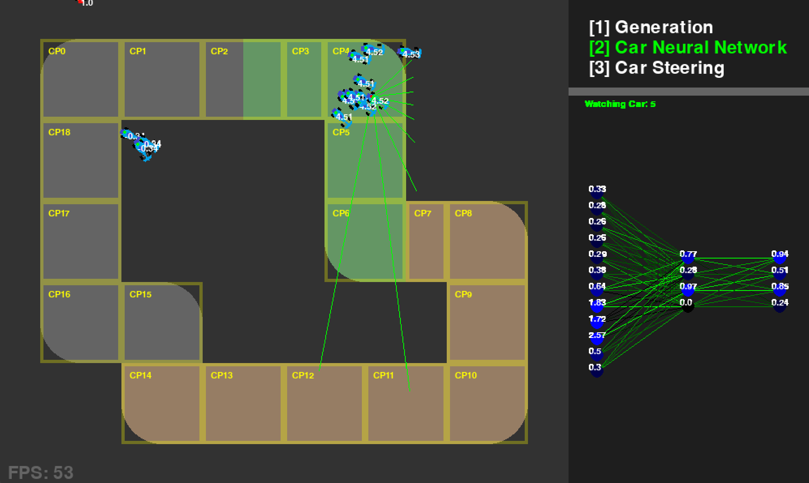

# Neural Network Racing
This program trains a neural network to race in a race tracks of varying condition. It was made as a custom project for the AI in Games unit, to showcase the potential of neural-network AI agents.

## Installation
- Clone or download
- Run "py Program.py" or "python Program.py"
- Uses Python 3.12.2
- Uses Pygame (pip install pygame)

## AI Code Files
- Car.py gets car neural network input layer values
- NeuralNetwork.py encapsulates functions for processing, copying and randomising the neural network

## Demo Game
By default the program will start training a new, basic neural network. 
To play a "Level 1" Basic race against the AI: 
- Load the wanted AI. This can be done through the [0][9][8][7] keys (explained further below), or can be loaded from a saved AI using the [L] key. An AI trained from scratch can also be used. 
- Press [D] to start a demo race. The player will be teleported to the track, the lights will go out, and the race will start. The winner will be determined by who completes a lap the fastest. Player car controls are desribed below, in the "Controls" section. 
- Press [D] to end the race, and resume training.

## All Controls
### Demo
Load pre-trained neural networks using:
- [0] Load 10x4 NN with basic track
- [9] Load 10x4x4 NN with basic track
- [8] Load 12x4 NN with terrain track
- [7] Load 12x4x4 NN with terrain track
- [6] Load 20x4 Collision NN with basic track
- [D] Starts Race (Level 1) with current settings.

### Saving and Loading Neural Networks
- [S] Saves Best Neural Network to file
- [L] Loads Neural Network from file

### Debug Pannel Controls
- [1] View Generation Stats
- [2] View Specific Car Neural Network Values
- [3] View Specific Car Steering Graph and value

### Manual Player Driving
- [Up] Accelerate
- [Space] Brake
- [Right] Steer Right
- [Left] Steer Left

### Other Controls
- [N] Force next generation
- [H] Toggle Headless mode (see console debug)
- [R] Toggle reward visibility
- [C] Toggle Collisions
- [P] Toggle CheckPoint Rendering
- [M] Cycle Map / Track. There are currently 2 raw, hard-coded maps
- [CTRL][M] Load Custom Map / Track File from "TrackSave.txt"
- [<] Decrease Debug Render Car Index
- [>] Increase Debug Render Car Index

### Changing Code Values
- Training.py holds constants which vary training. There are comments which explain them
- The [S] and [L] keys write and read from the "NeuralNetworkSave.txt" file. The files with names similar to "10x4NN.txt" and the demo neural networks.
- This program has a light map loader. Maps can be made in .txt format and loaded using [CTRL][M], from "TrackSave.txt". This file can be edited to make new, simple maps.
